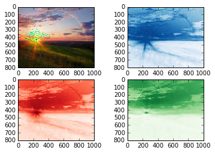
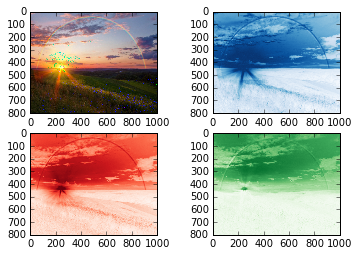

UECM3033 Assignment #2 Report
========================================================

- Prepared by: Chur Jian Chang
- Tutorial Group: T2

--------------------------------------------------------

## Task 1 --  $LU$ Factorization or SOR method

The reports, codes and supporting documents are uploaded to Github at: 

[https://github.com/joel913/UECM3033_assign2.git](https://github.com/joel913/UECM3033_assign2.git)

### Selection criteria ( LU or SOR )

The use of condition is to check whether the matrix is positive definite.
A matrix will be solved by SOR method when it is positive definite, otherwise it will be solved by LU method.

### Implementation for `task1.py`

---------------------------------------------------------

## Task 2 -- SVD method and image compression

## Zero elements in $\Sigma$
Q: How many non zero element in $\Sigma$?

A: All the elements in the three red, green and blue $\Sigma$ are non zero elements.

### Generating pictures from `task2.py`

##resolution of 30

### Generating pictures from `task2.py`

##resolution of 200

We will read the rainbow.jpeg into img where it contain 3 matrices, which is j,k and m. Each j,k and m is a 3 dimensions matrix. 
Then we make each matrix into U, $\Sigma$ and V which is j1,j2,j3 for blue by using linalg.svd, and so on for red and green, k and m.

# What is a sparse matrix?
A sparse matrix is a matrix which most of the elements are zero. On the other hand, a matrix is called dense where most of the elements are non zero. In this task, after we keep the first 30 non zero elements and set other elements to be zero, when the dimension of $\Sigma$ is converted to (800,1000) which created a sparse matrix of (800,1000) dimension matrix. This matrix is used for dot multiplication as mention above. Because the sparse matrix most elements is zero, this eventually help to make the lower resolution pictures.

-----------------------------------

last modified: 11/3/2016
